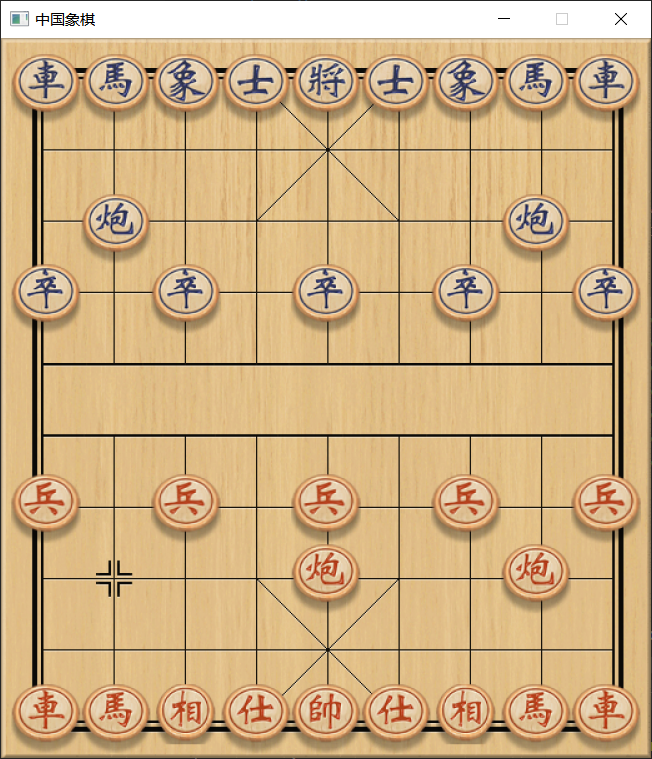

## Chinese Chess

### 题目要求

**alpha-beta剪枝算法**

编写一个中国象棋博弈程序，要求用alpha-beta剪枝算法，可以实现人机对弈。棋局评估方法可以参考已有文献，要求具有下棋界面，界面编程也可以参考网上程序，但正式实验报告要引用参考过的文献和程序。

### 构建页面

首先我们构建象棋页面，这里我们使用了 go 语言中的 ebiten 库来构建我们的页面。

我们通过网络下载了有关中国象棋的棋盘、棋子以及音效这些资源，然后通过 ebiten 官方给出的 file2byteslice 工具将资源文件转化为对应的 []byte 数组，并且使用现有的轮子将这些资源放进map便于我们程序的使用。

我们简单的定义中国象棋的棋盘为16\*16（原棋盘为9\*10）来方便我们之后对于棋子价值的评估。棋盘为1的位置被认定为是可以下棋的位置，否则不能下棋。这样就可以有效的解决边界问题。

```go
//ccInBoard 判断棋子是否在棋盘中的数组
var ccInBoard = [256]int{
	0, 0, 0, 0, 0, 0, 0, 0, 0, 0, 0, 0, 0, 0, 0, 0,
	0, 0, 0, 0, 0, 0, 0, 0, 0, 0, 0, 0, 0, 0, 0, 0,
	0, 0, 0, 0, 0, 0, 0, 0, 0, 0, 0, 0, 0, 0, 0, 0,
	0, 0, 0, 1, 1, 1, 1, 1, 1, 1, 1, 1, 0, 0, 0, 0,
	0, 0, 0, 1, 1, 1, 1, 1, 1, 1, 1, 1, 0, 0, 0, 0,
	0, 0, 0, 1, 1, 1, 1, 1, 1, 1, 1, 1, 0, 0, 0, 0,
	0, 0, 0, 1, 1, 1, 1, 1, 1, 1, 1, 1, 0, 0, 0, 0,
	0, 0, 0, 1, 1, 1, 1, 1, 1, 1, 1, 1, 0, 0, 0, 0,
	0, 0, 0, 1, 1, 1, 1, 1, 1, 1, 1, 1, 0, 0, 0, 0,
	0, 0, 0, 1, 1, 1, 1, 1, 1, 1, 1, 1, 0, 0, 0, 0,
	0, 0, 0, 1, 1, 1, 1, 1, 1, 1, 1, 1, 0, 0, 0, 0,
	0, 0, 0, 1, 1, 1, 1, 1, 1, 1, 1, 1, 0, 0, 0, 0,
	0, 0, 0, 1, 1, 1, 1, 1, 1, 1, 1, 1, 0, 0, 0, 0,
	0, 0, 0, 0, 0, 0, 0, 0, 0, 0, 0, 0, 0, 0, 0, 0,
	0, 0, 0, 0, 0, 0, 0, 0, 0, 0, 0, 0, 0, 0, 0, 0,
	0, 0, 0, 0, 0, 0, 0, 0, 0, 0, 0, 0, 0, 0, 0, 0}
```

### 页面响应

我们通过 MouseButtonLeft 来获取我们鼠标左边的响应， 用 CursorPosition 来获取鼠标的屏幕坐标，从而算出格子的坐标。同时我们添加了音效器让我们每下一步都会有音效，使得整个游戏过程更加真实。

### 棋子下法

我们从 resource.go 中获取各个棋子的图片，然后放置在各自的位置上。

每一个棋子的在某一个位置时，因为其的走法是固定的，所以能走的位置时有限的，从而我们可以得到他能走的全部位置，然后判断要下的位置是否符合规则。假如符合规则，则棋子移动；否则没有任何变化。

同时中国象棋中还有象眼、马脚等设定，士兵也有过河前和过河后两种状态，这里我们还要添加新的函数来判断。

我们通过一个数组保存当前所选择棋子能够走的所有位置，然后当玩家选择位置后，与数组中的位置作比较，从而判断玩家这一步是否成功下出。

我们同时对将军有着特殊的判断，假如这一步之后下一步能够攻击到主帅，那么就会触发“将”这一音效。我们还增加了飞将这个规则。

### 将死（胜负条件）

我们在被将军的时候会进行判断，假如存在一步棋能够使得将军结束，那么游戏就不会结束。否则，判定游戏结束。

和棋也是象棋中的一种现象，我们设定如果一种局面在一方出现了3次，那么我们就判断这场为和棋。判断方法也比较简单，就是比较相邻的几个校验码，假如重复3次就和棋。

### AI设定

我们对于每个棋子有着不同的价值，这个价值与棋子的种类以及棋子的位置相关。我们预先在其所有能够到达的位置对于价值进行了定义。然后AI会判断怎么走会使得局面价值最大，从而进行自己的决定。

### Alpha-beat剪枝

**简介：**

​	我们将象棋定义为一棵博弈树，每一个节点都是棋盘上的一种状态，子节点就是父节点状态在下一步棋之后的转移。然后我们引入历史表，也就是类似于棋谱的一个结构，用来保存一些比较好的走法。这样在迭代加深搜索的时候，做完浅层的搜索，历史表中就会存有相当多的走法，减少了深层搜索的时间。


**效率的提高**

​	Zobrist校验码：我们通过Zobrist键来将局面映射成一个特殊的哈希值，这样可以实现我们后面需要的置换表等功能。最简单的，我们通过置换表来将一些不同的下法但是相同的局面保存到一起，这样就可以减轻我们搜索的难度。

**历史启发**

​	搜索树中某一个节点存在一个好的着法，那么对于其他的节点也可能是好的着法。好的着法指的是可以引发剪枝或者是最好的着法，这样的着法会被基于一个增量使得其在历史表中排在前面，从而使得好的着法能够更优先地被执行。

**杀手启发**

​	杀手启发式历史启发的特例，他是把同一层中引发剪枝最多的着法称为杀手，当下次搜索到同一层次，如果杀手是合法的走步，就优先搜索杀手。

**水平线效应的解决**

​	静态搜索，通过局面评价来判断是否只搜索吃子走法，假如局势很好则截断，否则就尝试吃子。

​	空步裁剪，轮到自己下的时候，预测对方多下一步会下在哪里，从而去提前规划。

​	将军局面下，对于搜索深度的加大。

**置换表**

​	置换表用来检测是否可以避免重复劳动的情况。同时置换表可以让我们在散列项中先找到最好的落子方法，从而改进落子的顺序，减少分枝。

**优化走法**

​	假如置换表中存在当前局面的数据，那么我们首先尝试置换表中的数据；假如存在杀手，那么优先走杀手；假如都没有那么生成全部的走法，按照历史表排序后搜索。

### 开局库

开局库是一个象棋程序所必需的。开局库会使得AI在开局不再只走那么几步，从而使得整个局面能够更加多变，使得整个搜索的过程更加全面。当开局脱离开局库的时候，AI的下法也还是会单一，那么这个时候我们给定一个概率，使得AI不一定选择最优的下法，从而能够一定程度上避免重复局势的出现。


### 页面展示

棋盘：


加上棋子：


我方走棋：



敌方走棋：


我方选择棋子：


敌方选择棋子：


下棋动图：


### References

- [用Go写一个中国象棋](https://wangqianhong.com/tag/%e4%b8%ad%e5%9b%bd%e8%b1%a1%e6%a3%8b/)

- IMPROVEMENT ON ALPHA-BETA SEARCH ALGORITHM IN CHINESE CHESS  YUE Jinpeng FENG Su(College of Information Science and Technology,Beijing Normal University,100875,Beijing,China)

- A New Hashing Method With Application for Game Playing AL Zobrist The University of Wisconsin Computer Sciences Department 1210 West Dayton Street Madison,  Wisconsin 53706 Technical Report April 1970

